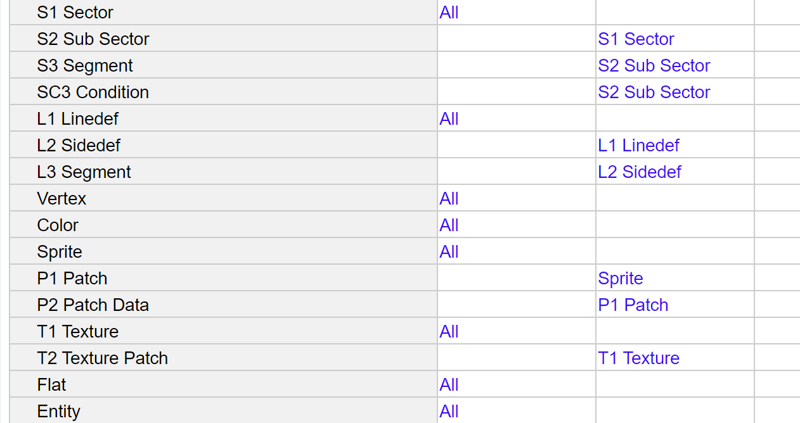

# AnaDoom, Doom in Anaplan
How I implemented the base of Doom in Anaplan.

## Table of Contents
- [Introduction](#introduction)
- [How it works (in short)](#how-it-works-in-short)
- [Deep Dive](#deep-dive)
  * [Pre-requisites to understand](#pre-requisites-to-understand)
  * [How in the world did you implemented 3D in Anaplan?](#how-in-the-world-did-you-implemented-3d-in-anaplan)
  * [First step: Trigonometry is your friend](#first-step-trigonometry-is-your-friend)
  * [Second step: Store the data in Anaplan](#second-step-store-the-data-in-anaplan)
  * [Third step: Store the data in Anaplan](#third-step-store-the-data-in-anaplan)
  * [Fourth step: Calculate](#fourth-step-calculate)
  * [Fifth step: Display](#fifth-step-display)
  * [Sixth step: Add the pistol, because why not?](#sixth-step-add-the-pistol-because-why-not)
  * [Seventh step: Add replay](#seventh-step-add-replay)
  * [Seventh step: Well, that's it](#seventh-step-well-thats-it)


## Introduction
Ok, everything started from a simple Google search. `DOOM ANAPLAN`, and you know what? I found nothing. That was unacceptable. So here we are, after so many hours, a playable version[1] of Doom in Anaplan. 

[1] Well, it's not really playable, but you can move around at 1/20 fps (yes, there are no mistake in the number) with a quarter of pixels of the original game.
That's something, right?

## How it works (in short)
The game is based on a 2D grid (160x100).
The grid is composed of 2 lists (one for x axis, one for y axis).
By dezooming the grid, you can see all the cells.
Colors are made via Conditional formatting.

Since Anaplan doesn't support loop for switching frames automatically, a new frame is calculated every time the players moves.
Moves are handled by buttons (turn left, turn right, move forward, move backward, wait).

For now, only the first map (E1M1) of Doom is implemented. The switch between maps can be done by charging the corresponding files.

Since it's kind of impossible to implement an iterative algorithm. Each combination of pixel with the wall and floor/celling is calculated. That's why the game is so slow.

> But it works!

## Deep Dive
### Pre-requisites to understand
- Knowledge of Anaplan
- Knowledge of Doom and WAD files

### How in the world did you implemented 3D in Anaplan?

I didn't. I implemented a 2D grid with a 3D illusion. I will not go into the details of how doom works (there are plenty of resources on the internet), but I will explain how I adapted it to Anaplan.

### First step: Trigonometry is your friend
The first thing to do was to calculate the angles. Other wise, how would you know where the player is looking at witch angle?

But how do you calculate sin and cos in Anaplan? Well, you don't. Since Anaplan doesn't support basic trigonometry functions (really Anaplan?), you have to find a workaround.
Ether you calculate the values. Anaplan provides a model to calculate the trigonometry functions. But my eyes were bleeding after 5 minutes of reading the formulas.
Or you can use a simple lookup table with pre-calculated values.
This table store sin, cos, tan, arctan, etc.
A little bit of python and you can generate the table (ask gpt if you want some help on this part).

What it's look like in Anaplan:


### Second step: Store the data in Anaplan
Sadly, Anaplan doesn't support WAD files.
So the first step is to convert the WAD file to a CSV files.
Sooooo before going further, lets take a look of my interpretation of the WAD file... via a Class Diagram!


Each class is a CSV file.
Some are copy past of the WAD file, some are from my own interpretation.
I made some assumptions, like LineDef can only be part at most of 2 sectors.

Let's take a look at the weird parts:
- **Conditions**: Since I dont want to implement a full binary tree (this is possible, but I don't want to miss with the time dimension in order to implement recursion...), I decided to store the each step of the tree as a "condition".
Each Sub Sector has a set of conditions. If the player is in the sub sector, then the conditions are checked. If the conditions are met, then the sub sector is the one the player is in. Logical, right?
This took a bit more place then the binary tree, but it's easier to implement. The only annoying part is to generate the conditions from the binary tree (the python script is a bit messy).


- **Segmets**: One segment has one SideDef and one SubSector. So in Anaplan, we will have two lists (one for each).


- **Patch Data**: This one is not necessary, but I wanted to optimize the displayed pixels. 
Take a wall in front of the player, if the player is close to the wall, every pixel of the wall will be displayed.
But if the player is far from the wall, only few pixels will be displayed and who knows witch color of the wall will be the chosen one.
So I decide to store also the compressed data of the wall. Now, each patch has 8 versions. Each version is the compressed by 1, 2, 4, 8, 16, 32, 64 and 128. Each step take the average color of the pixels.
The python here is even more messy, but it works[2].

[2] Well not really, the approximation when merging the 4 pixels to 1 seem to be wrong. So I temporally disabled the feature.
  
- **Data** in Patch Data: Since there are only 255 colors in the game (this palette is called PLAYPAL). Each pixel can be the combination of 3 digits [0-9] (you can store it in ascii or in hex but good luck to read it in Anaplan). So let's just store each pixel in a string and then read it in Anaplan!
```sql
-- This is the formula to read the pixel color in Anaplan
-- its a bit more complex with the compression, but you get the idea
VALUE(MID('SYS P2 Patch Data'.Data[LOOKUP: Patch Data],
   ROUND(Wall Patch x / 'SYS P2 Patch Data'.Compression[LOOKUP: Patch Data], 0, DOWN) 
    * 'SYS P2 Patch Data'.Height[LOOKUP: Patch Data] 
    * 3 
   + ROUND(Wall Patch y / 'SYS P2 Patch Data'.Compression[LOOKUP: Patch Data], 0, DOWN) 
    * 3 
   + 1, 
   3))
```

### Third step: Store the data in Anaplan
Now that we have the data, we need to store it in Anaplan.
This is not the most complex part.

The lists of data:



The Entity is just the concatenation of SubSectore and Segments.
I use one list so its easier to find the closest wall/floor/ceiling for each pixel.

The lists for other things:


### Fourth step: Calculate
Now there are a lot of calculations to do.
I'm fare to lazy to explain everything here, but you just need to know that its involve a lot of Angle calculations, distance calculations, and a lot of "ok so here I calculate the distance between the player and the wall via pythagore, then I calculate the true distance by including the vertical angle of the pixel (that is not always parallel to the ground), then I find the coordinate of the crossing point between the line of sight and the wall in the wall coordinate, then I find if the crossing point is valid (inside the wall) and IF the distance is closer than any floor nor ceiling, then I determine the compression to use and finally determine the color of the pixel.".
And you do the same for the flats (floor and ceiling), but a bit different since they are always parallel to the ground (but you need to use the Conditions to determine if the crossing point is valid).

This is what it looks like in Anaplan:


Did I mention its possible to play it in Multiplayer?


Well in most of the module, you can see the "User" dimension. So you can technically play it in multiplayer.
Well, imagine the lag if I double the size of the model...

### Fifth step: Display
Now that we have the data, we need to display it.

I already explained how the grid id made and its use of Conditional formatting.
But did I mention the number of Conditional formatting rules? Yes, there are 255 rules. My browser is lagging when I try to edit the rules.

I never add all the colors by hand.
I used Slanaplan (an AMAZING tool I created to interact with Anaplan via an extension but I cant share it with you, sorry) to generate the rules. So I just copy past my CSV file with the colors to Slanaplan, run it, and 5 minutes later, ta-da, all the rules are created.


Final result:


### Sixth step: Add the pistol, because why not?
I added the pistol.
It's just a sprite that moves with the player.
It's not really useful, but it's cool.

### Seventh step: Add replay

I added a replay feature.
So I can export to create my gifs (it's simpler than recording the screen... and wait 20 seconds for each frame).

Lets take the first gif I generated:


Pretty ugly, right?
At this time, they where a lot of bugs.


### Seventh step: Well, that's it
Now, there are all the game mechanics to implement, like:
- The things (monsters, items, etc.)
- Health, ammo, etc.
- Shooting
- Collisions
- Improve the performance
- Correct the patches that seems to be miss aligned/placed

But it takes time.

So let's call it a day.

...

For now :)

## 
